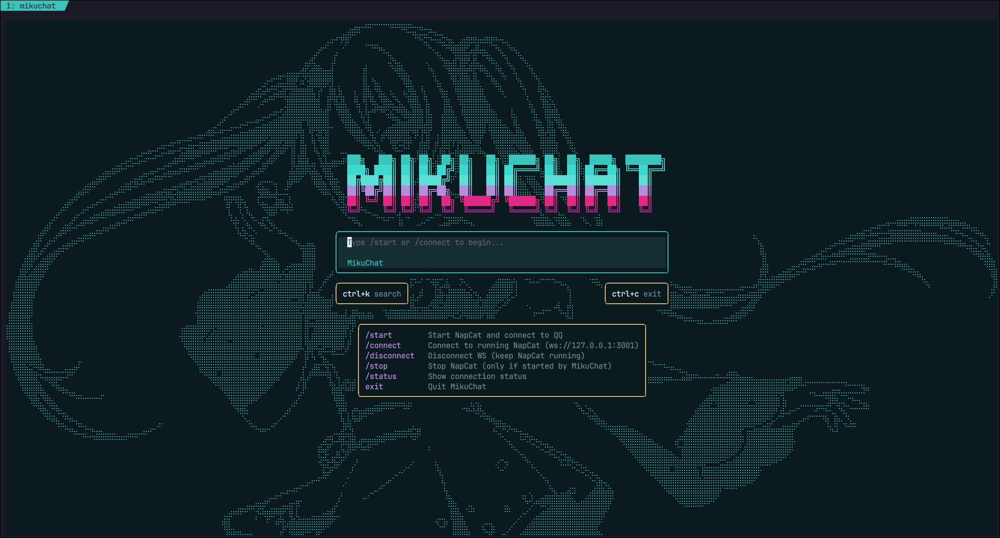

<div align="center">

# MikuChat

**Terminal-based QQ chat client with Miku aesthetics.**

Built on [Bun](https://bun.sh) + [SolidJS](https://solidjs.com) + [OpenTUI](https://github.com/anomalyco/opentui) + [NapCat](https://github.com/NapNeko/NapCatQQ) (OneBot 11)



</div>

---

## Features

- Full QQ messaging via NapCat (OneBot 11 WebSocket)
- Braille art Miku background, dynamically scaled to terminal size
- Per-user colored message bubbles with reply quotes
- QQ Face ID to Unicode emoji mapping (250+ entries)
- Inline image rendering via Kitty Graphics Protocol (Unicode Placeholders)
- Freeze-scroll mode: browse history without being interrupted by new messages
- Fuzzy session search (`Ctrl+K`)
- 34 built-in color themes (default: `miku`)
- SQLite message persistence (`bun:sqlite`)
- One-command install from source

## Requirements

| Dependency | Version | Required |
|---|---|---|
| [Bun](https://bun.sh) | >= 1.1 | Yes |
| [Kitty](https://sw.kovidgoyal.net/kitty/) | >= 0.28 | Yes |
| [NapCat](https://github.com/NapNeko/NapCatQQ) | latest | Yes |
| [Xvfb](https://www.x.org/releases/X11R7.6/doc/man/man1/Xvfb.1.xhtml) | any | Only for `/start` |

## Install

```bash
git clone https://github.com/MahoMaho-Rize/mikuchat.git ~/mikuchat
cd ~/mikuchat
./install.sh
```

The install script builds from source and checks all runtime dependencies. Then:

```bash
mikuchat
```

## Quick start

1. [Install NapCat](https://github.com/NapNeko/NapCatQQ/releases) and extract to `~/NapCat/`
2. Configure NapCat OneBot 11 WebSocket (port 3001, `reportSelfMessage: true`)
3. Run `mikuchat`, type `/start` to launch NapCat, or `/connect` if it's already running

See [QUICKSTART.md](QUICKSTART.md) for detailed setup instructions.

## Usage

### Home screen

| Command | Description |
|---|---|
| `/start` | Launch NapCat + connect |
| `/connect` | Connect to running NapCat |
| `/disconnect` | Disconnect WebSocket |
| `/stop` | Stop NapCat |
| `/status` | Show connection status |
| `exit` | Quit |

### Chat

| Key | Action |
|---|---|
| `Enter` | Send message |
| `Meta+Enter` | New line |
| `Ctrl+B` | Toggle sidebar |
| `Ctrl+K` | Search conversations |
| `PageUp/Down` | Scroll history |
| `Home` | Load older messages |
| `End` | Jump to latest |

## Configuration

MikuChat auto-detects the QQ binary from common locations. Override with:

```bash
export NAPCAT_QQ_PATH=/path/to/qq
```

## Tech stack

| Layer | Technology |
|---|---|
| Runtime | Bun (`bun:sqlite`, ESM, JSX) |
| UI | SolidJS + OpenTUI |
| Terminal | Kitty (Graphics Protocol) |
| QQ backend | NapCat (OneBot 11 WebSocket) |
| Database | SQLite (WAL mode) |
| Image processing | sharp |

## License

MIT
